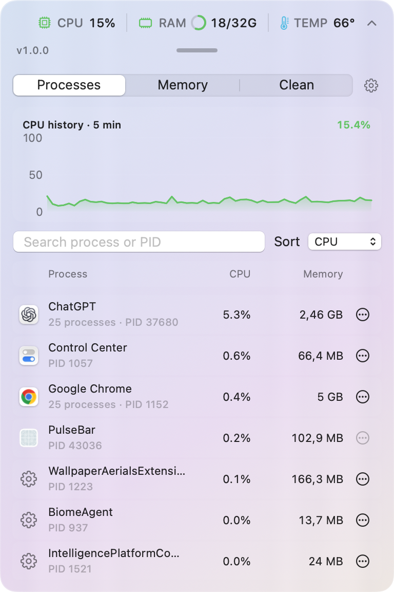
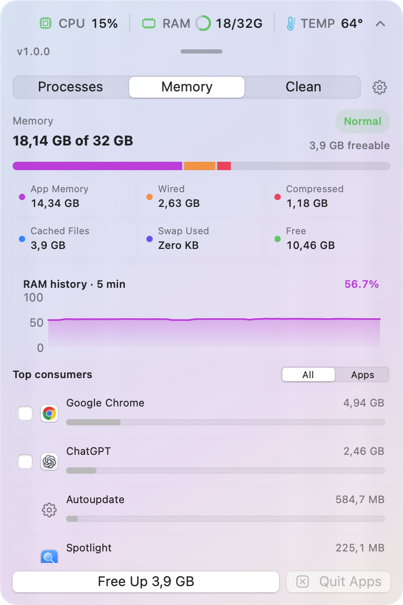
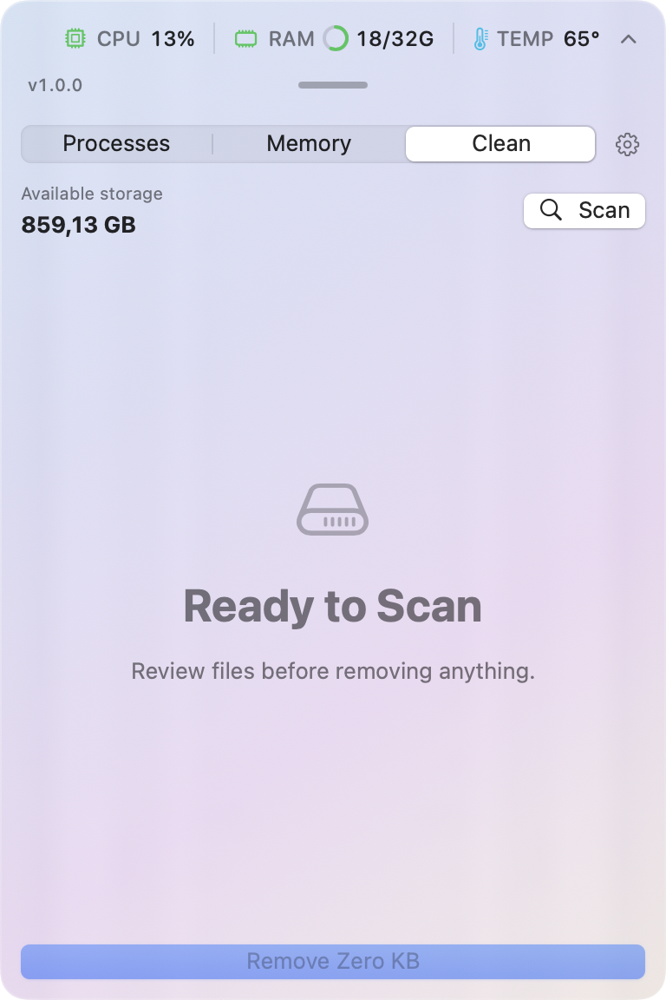
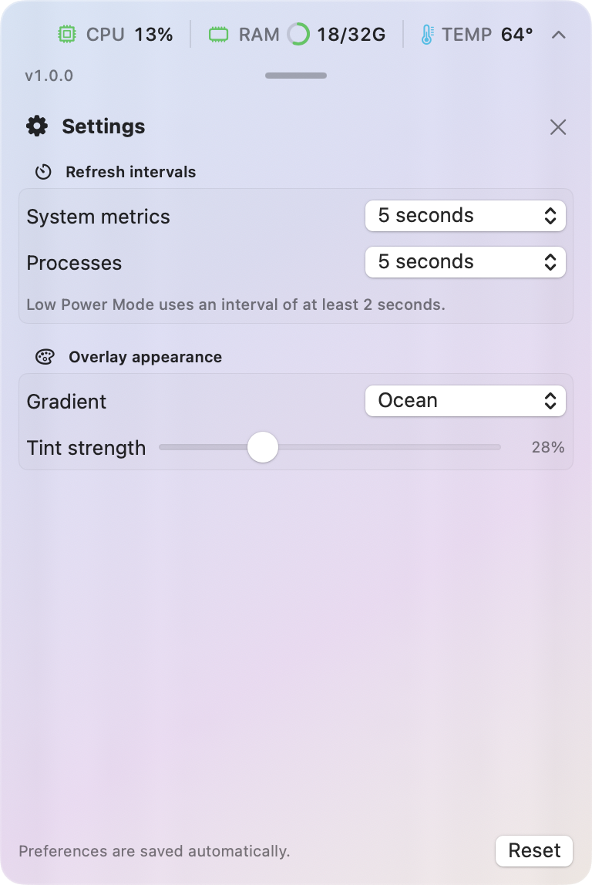

# PulseBar

PulseBar is a lightweight, native macOS system monitor for keeping CPU, memory, and device temperature visible without taking over the desktop. Its translucent compact bar sits near the top-right of the active display and expands downward into a focused resource-control panel.

PulseBar takes inspiration from the convenience of utilities such as CleanMyMac while remaining an independent, on-device project that is not affiliated with MacPaw.

<p align="center">
  
</p>

## Product tour

| Processes | Memory |
| --- | --- |
|  |  |

| Clean | Settings |
| --- | --- |
|  |  |

## Features

- **At-a-glance monitoring** — View live CPU percentage, a RAM usage ring with shortened used/total memory, and device temperature from the compact overlay.
- **Top-edge placement** — Keep the bar close to the macOS menu bar, available across Spaces and full-screen apps, or drag it elsewhere.
- **Process inspector** — Inspect apps and background services by CPU or memory; related helper processes are grouped under their owning app.
- **Search and control** — Search by process name or PID, then quit or force-stop allowed processes. PulseBar and critical macOS processes are protected.
- **Performance history** — View a rolling five-minute CPU chart in Processes and RAM chart in Memory.
- **Memory insights and relief** — Review app, wired, compressed, cached, swap, and free memory; see an estimate of freeable cached memory; ask macOS to reclaim it without quitting apps; or separately select, confirm, and quit multiple applications.
- **Disk cleanup** — Scan caches, logs, Trash, Xcode DerivedData, and large files before choosing which categories to clean.
- **Configurable behavior** — Choose independent system and process refresh intervals, with slower sampling during Low Power Mode.
- **Custom appearance** — Select Ocean, Aurora, Sunset, or Graphite gradients and adjust the tint over native macOS blur.
- **Open at Login** — Start the signed app automatically after signing in.

## How to use

1. Launch PulseBar; the compact monitor appears near the top-right of the active display.
2. Double-click anywhere in the monitor header to switch between compact and expanded modes.
3. Use **Processes** to inspect grouped apps and services, search, sort, or stop an allowed process.
4. Use **Memory** to review the full RAM breakdown and top consumers. Choose **Free Up** to reclaim cached memory without quitting apps, or select applications and choose **Quit Apps** to review a confirmation first.
5. Use **Clean** to scan removable files, review every category, and clean only the selected categories.
6. Open the gear button to configure refresh intervals, gradient palette, and tint strength.
7. Click and drag anywhere in the monitor header or the expanded-panel handle to reposition PulseBar.
8. Right-click the monitor to enable **Open at Login**, reset its position, or quit.

Stopping a process can discard unsaved work. Try a normal quit first and force-stop only an unresponsive app. Review cleanup selections carefully because removed files may not be recoverable.

## Build from source

Requirements: macOS 14 Sonoma or later and Xcode 15/Swift 5.9 or later. Temperature availability depends on the hardware sensors exposed by the Mac; PulseBar displays an unavailable indicator when it cannot obtain a compatible reading.

```bash
git clone https://github.com/thanhdanh/CleanMacMini.git
cd CleanMacMini
swift run PulseBar
```

You can also open `Package.swift` in Xcode, select the **PulseBar** scheme, and run it. Open at Login is intended for a signed `.app` bundle and may not persist when PulseBar is run as a Swift package executable.

To create a local `.app` and ZIP archive:

```bash
./scripts/package-app.sh
```

The script writes `PulseBar.app` and `PulseBar-1.0.0.zip` to `dist/`. It uses ad-hoc signing unless `SIGN_IDENTITY` names an installed Developer ID Application certificate. Public release publishing is intentionally deferred; the signing and notarization tools remain available for that later release.

## Versioning

PulseBar follows Semantic Versioning. The current development version is stored in `VERSION` and `Resources/Info.plist`, changes are recorded in `CHANGELOG.md`, and release tags use the `vMAJOR.MINOR.PATCH` format. The current version is `1.0.0`; public release publishing is deferred.

## Privacy and permissions

PulseBar reads system metrics, available hardware temperature sensors, process information, and user-selected cleanup locations locally. It does not require an account or transmit this information.

- PulseBar can stop only processes permitted by the current macOS user.
- Protected system processes cannot be stopped from the app.
- Purging inactive memory can show an administrator prompt.
- Files outside accessible user folders may require additional macOS permissions.

Memory relief is not a replacement for macOS memory management. macOS intentionally uses available RAM for useful caches, so lower used memory does not always mean better performance.

## Project structure

```text
Sources/PulseBar/   Application source
Resources/          Bundle metadata
docs/images/        Current product screenshots
scripts/            Packaging and notarization tools
.github/workflows/  Signed release automation
```
